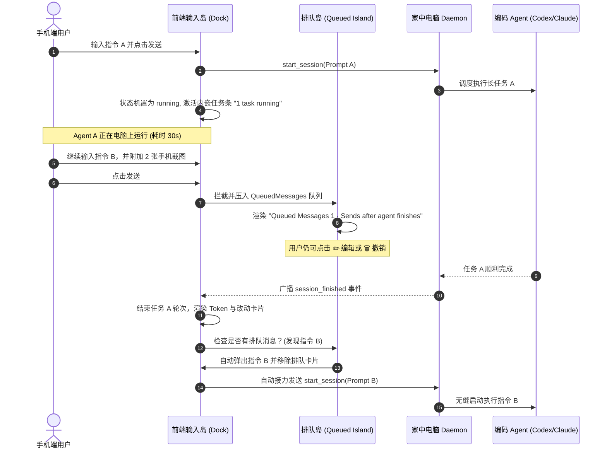

# Google Antigravity 2.0 移动与 Web 伴侣产品需求文档 (PRD)

> **版本**：v2.0.0-PROD  
> **基准参考**：`https://antigravity.google.com/r/c0ceb386-2b04-427b-82fa-882c28bf3ea4-v2` & 生产环境移动端真机截屏  
> **文档定位**：深度解构 Google Antigravity 2.0 的业务构成、数据实体、状态机体系、UI 树形结构与交互规范，为 CloudWork 掌上指挥官提供全量对齐标准。

---

## 1. 业务全景与产品定位 (Product Landscape)

```
Google Antigravity 2.0
├── 核心愿景：AI-First 跨端自主编码协同系统 (Agentic Remote OS)
├── 典型场景
│   ├── 场景 A (移动出行)：上下班/公司外出期间，手机端随身监控家中/工位 PC 的长周期编码任务
│   ├── 场景 B (离线接力)：手机端输入碎片化需求与报错截图，自动异步排队，PC 端无感调度执行
│   └── 场景 C (轻量审查)：随时在手机上做架构方案评审 (Plan)、代码审查 (Diff)、权限放行 (Approval)
└── 产品形态
    ├── 桌面端 (Electron / Desktop Web)：重度开发主阵地，全功能代码编辑与侧边多 Agent 监控
    └── 移动伴侣 (Mobile Web / PWA)：轻量遥控中心，聚焦“对话决策、任务排队、终端监控、改动审查”
```

---

## 2. 核心业务实体与数据模型 (Core Entities)

Antigravity 2.0 的业务底层由以下 7 大核心实体支撑：

```
业务实体模型 (Entity Relationship)
├── 1. Session (会话运行体)
│   ├── session_id: String (UUID, 如 c0ceb386-2b04-427b-82fa-882c28bf3ea4-v2)
│   ├── workspace_root: String (绑定的工作区绝对路径)
│   ├── active_agent: Enum [Gemini 3.8 Flash High, Claude Code, OpenAI Codex, Aider]
│   ├── status: Enum [idle, running, waiting_approval, completed, terminated]
│   └── turns: List<Turn>
│
├── 2. Turn (单轮问答容器 - Single Turn Container)
│   ├── turn_id: String
│   ├── timestamp: DateTime
│   ├── user_input: UserInput (文本、@ 引用、多张图片附件)
│   ├── thinking: ThinkingBlock (折叠思考与规划)
│   ├── steps: List<ToolStep> (已聚合折叠的终端命令与工具执行)
│   ├── message: MarkdownContent (纯净的人类可读正文)
│   ├── artifacts: List<Artifact> (生成的架构方案、报告、图表)
│   ├── file_diff: DiffSummary (代码改动统计与文件清单)
│   └── metrics: TurnMetrics (Token 输入/输出、耗时、退出码)
│
├── 3. QueuedMessage (异步排队消息)
│   ├── queue_id: String
│   ├── session_id: String
│   ├── prompt: String
│   ├── attachments: List<ImageAttachment> (图片/截图 base64 或 URI)
│   ├── status: Enum [queued, dispatching, cancelled]
│   └── priority: Integer (支持插队抢占)
│
├── 4. RunningTask (后台常驻与异步任务)
│   ├── task_id: String
│   ├── name: String (如 "powershell go test ./...")
│   ├── start_time: DateTime
│   ├── elapsed_seconds: Integer
│   ├── terminal_output: Stream<String> (实时流式日志)
│   └── interruptible: Boolean (是否支持 ⏹ 强制中断)
│
├── 5. Artifact (交付工件)
│   ├── artifact_type: Enum [ImplementationPlan, Walkthrough, ArchitectureReport]
│   ├── title: String (如 "Implementation Plan")
│   ├── summary: String (双行省略摘要)
│   ├── content_markdown: String
│   └── review_status: Enum [pending_review, approved, rejected]
│
├── 6. FileDiff (变更审查集)
│   ├── files_changed_count: Integer
│   ├── insertions_count: Integer (如 +1912)
│   ├── deletions_count: Integer (如 -1183)
│   └── patches: List<FilePatch> (Unified Diff 补丁树)
│
└── 7. ApprovalRequest (高危操作权限单)
    ├── request_id: String
    ├── command_or_tool: String
    ├── risk_level: Enum [low, medium, high]
    └── status: Enum [pending, allowed, rejected]
```

---

## 3. 产品功能模块树形结构 (PRD Functional Tree)

```
Antigravity 2.0 移动端产品功能树
│
├── 1. 顶栏全局状态与导航 (App Header)
│   ├── 1.1 会话回退与侧边栏开关 (Back / Drawer Trigger)
│   │   ├── 触发左侧全功能抽屉滑出
│   │   └── 包含新建对话快捷键与历史会话导航
│   ├── 1.2 空间与设备状态指示 (Workspace & Device Indicator)
│   │   ├── 主标题：项目与会话名称 (如 "AI Coding Remote Cont...")
│   │   └── 副标题：网络与电脑连接状态 (微型脉冲点 + "家中电脑已连接")
│   └── 1.3 辅助动作功能组 (Auxiliary Action Group)
│       ├── 1.3.1 终端控制台快捷键 (Terminal Drawer Trigger)
│       ├── 1.3.2 变更审查快捷键 (Git Diff Trigger)
│       ├── 1.3.3 会话历史抽屉快捷键 (Session History Trigger)
│       └── 1.3.4 账号与用户配置 (Avatar with Conic Gradient Ring)
│
├── 2. 主对话交互画布 (Conversation Canvas)
│   ├── 2.1 用户提问消息 (User Turn Block)
│   │   ├── 2.1.1 气泡样式：深色圆角胶囊 (#24272e, 18px 倒角)
│   │   └── 2.1.2 附件图片画廊：横向无边界滚动缩略图列表 ([img] [img] [+X])
│   │
│   ├── 2.2 Agent 单轮聚合回复 (Single Turn Container)
│   │   ├── 2.2.1 Agent 身份标识 (Logo 图标 + 模型品牌，如 AI CODEX)
│   │   ├── 2.2.2 深度思考折叠条 (Thinking Accordion)
│   │   │   ├── 折叠态：💭 深度思考与规划已就绪 [展开/收起]
│   │   │   └── 展开态：等宽字体呈现规划草稿与 CoT 思维链
│   │   ├── 2.2.3 智能折叠步骤清单 (Steps Accordion - 解决 15 个工具霸屏痛点)
│   │   │   ├── 运行时：实时刷新当前步骤 (⚙️ 正在执行步骤 3/10: powershell ...)
│   │   │   ├── 完成时：紧凑收拢为单行 (⚙️ 已完成 10 个执行步骤 [明细 >])
│   │   │   ├── 命令净化引擎：彻底剔除 PowerShell 全路径冗余前缀
│   │   │   └── 展开态：展示每步命令简写、成功图标与退出码
│   │   ├── 2.2.4 高危权限审批卡片 (Inline Approval Card)
│   │   │   ├── 黄色高亮边框警示
│   │   │   ├── 目标命令预览与风险阐述
│   │   │   └── [❌ 拒绝] 与 [✅ 允许执行] 双按钮即时回调
│   │   ├── 2.2.5 正式回答渲染体 (Markdown Renderer)
│   │   │   ├── Google Sans 级排版与标题层级
│   │   │   ├── 官方琥珀金行内代码高亮 (#f2c94c + 12% 衬底)
│   │   │   └── 语法高亮代码块 (支持横向滚动)
│   │   ├── 2.2.6 交付工件卡片 (Artifacts Card)
│   │   │   ├── 方案卡片：📄 Implementation Plan
│   │   │   ├── 双行内容自动截断预览
│   │   │   └── 点击滑出全屏工件阅读器
│   │   ├── 2.2.7 代码改动审查卡片 (Files Changed Card)
│   │   │   ├── 变更统计：X files changed +A -B >
│   │   │   ├── [📄 Review] 动作键
│   │   │   └── 点击滑出全屏红绿 Diff 审查抽屉
│   │   └── 2.2.8 交互反馈底栏 (Turn Action Bar)
│   │       ├── Google 官方 Material Symbols：[📋 复制] [👍 点赞] [👎 点踩]
│   │       └── 微型元数据：Token 消耗数与完成时间戳
│   │
│   └── 2.3 底部防遮挡缓冲层 (Dynamic Bottom Padding)
│
├── 3. 非阻塞排队系统 (Queued Messages Island)
│   ├── 3.1 触发机制：当底层 Agent 正在运行任务时，用户在底座输入并发送
│   ├── 3.2 悬浮位置：精准吸附于输入底座正上方
│   ├── 3.3 顶部状态条：Queued Messages 1 · Sends after agent finishes ˅
│   ├── 3.4 缩略内容与图片卡：展示排队 prompt 及已选图片附件
│   └── 3.5 动作矩阵：
│       ├── [→ 插队直发]：中断当前任务或置顶立即下发
│       ├── [✏️ 编辑]：重填回输入底座进行修改
│       └── [🗑️ 删除]：放弃此排队指令
│
├── 4. 签名集成式输入底座 (Docked Input Island)
│   ├── 4.1 任务运行内嵌状态头 (Dock Task Header)
│   │   ├── 状态显示：● 2 tasks running (00:15)
│   │   ├── 呼吸指示灯：浅蓝微光交替闪烁
│   │   └── 点击交互：触发底层 Terminal 控制台抽屉滑出
│   ├── 4.2 自适应弹性输入框 (Elastic Textarea)
│   │   ├── 占位符：Ask anything, @ to mention, / for actions
│   │   ├── 自动增高：1 行到 4 行智能伸缩
│   │   └── 回车逻辑：移动端换行，桌面端快捷发射
│   ├── 4.3 底部多维操作行 (Dock Action Row)
│   │   ├── 4.3.1 [+] 快捷功能展开键 (Action Sheet Trigger)
│   │   │   ├── 📷 上传手机相册截图
│   │   │   ├── 🧪 运行单元测试
│   │   │   ├── 🔍 审查 Git 改动
│   │   │   └── 📝 制定方案计划
│   │   ├── 4.3.2 模型切换药丸 (Model Pill Selector)
│   │   │   └── 下拉支持：Gemini 3.8 Flash High / Claude Code / Codex
│   │   └── 4.3.3 圆形状态机发射键 (Adaptive Send Button)
│   │       ├── 空闲态：灰色禁用箭头
│   │       ├── 就绪态：高亮蓝色发射箭头 (#a8c7fa)
│   │       └── 任务态：红色停止键 (⏹)，支持随时切断
│   │
├── 5. 辅助与控制抽屉矩阵 (Drawers & Sheets)
│   ├── 5.1 会话与工作区侧边抽屉 (Sessions & Workspaces Drawer)
│   │   ├── [+ 新建对话] 按钮
│   │   ├── 电脑端工作目录展示与实时绝对路径切换
│   │   └── 最近会话历史列表 (带状态指示与快捷载入)
│   ├── 5.2 终端任务控制台抽屉 (Terminal Sheet)
│   │   ├── 任务计数与计时器
│   │   ├── 终端实时流式 ANSI/文本输出 (自动滚动到底部)
│   │   └── [⏹ 终止任务] 强制控制
│   └── 5.3 全屏 Git Diff 审查抽屉 (Full-screen Diff Viewer)
│       ├── 统计摘要面板 (files changed, insertions, deletions)
│       ├── 绿色新增行与红色删除行语法高亮
│       └── 补丁代码块独立滑动
```

---

## 4. 关键交互流程与状态机规范 (Workflows & State Machines)

### 4.1 非阻塞消息排队时序 (Queued Messages Lifecycle)



### 4.2 步骤聚合与降噪状态机 (Steps Aggregation)

```
       [工具开始事件: tool_call_start]
                     │
                     ▼
          [净化命令路径: Prettify]
(去除 C:\WINDOWS\System32... 冗余前缀)
                     │
                     ▼
      [是否已有步骤折叠条 (Steps Box)?]
        ├── 否 ──> 动态创建 Steps Accordion 容器
        └── 是 ──> 递增步数计数器 (StepCount++)
                     │
                     ▼
       [更新状态：⚙️ 正在执行步骤 (X)]
                     │
                     ▼
        [工具完成事件: tool_call_end]
                     │
                     ▼
       [标记该步完成: ✓ 完成 (绿色)]
                     │
                     ▼
       [Agent 最终回答 / 任务结束事件]
                     │
                     ▼
      [收拢折叠：⚙️ 已完成 N 个执行步骤]
          (仅占用 32px 单行空间)
```

---

## 5. UI/UX 视觉规范标准 (Design System Tokens)

全部对齐 Google Antigravity 2.0 生产环境：

| 设计维度 | 参数规范 | 说明 |
| :--- | :--- | :--- |
| **主背景色** | `#131314` | Google Gemini / Antigravity 标志性深空灰黑 |
| **卡片/抽屉背景** | `#1e1f20` / `#1e2024` | 具有明确层级感的中度表面灰 |
| **边框系统** | `1px solid rgba(255, 255, 255, 0.08)` | 极细微米级柔和边线，杜绝粗糙白线 |
| **文字主色** | `#e3e3e3` | Material 3 on-surface 高对比度白灰 |
| **文字副色** | `#9aa0a6` | on-surface-variant 柔和次要文本 |
| **重点品牌色** | `#a8c7fa` | Google 浅蓝，用于就绪按钮、工件图标 |
| **行内代码与路径**| `#f2c94c` / `rgba(242, 201, 76, 0.12)` | 琥珀金与半透明衬底，极高代码可读性 |
| **新增与成功** | `#3fb950` | 柔和薄荷绿 |
| **删除与危险** | `#f85149` / `#ea4335` | 警示珊瑚红 |
| **字体族 (Font)** | `"Google Sans Text", "Google Sans", sans-serif` | 谷歌专属现代排版几何字体 |
| **等宽字体 (Mono)**| `ui-monospace, SFMono-Regular, Menlo, Consolas` | 终端、代码块与 Diff 专用 |
| **图标体系** | `Google Material Symbols Outlined` | 矢量原生图标，彻底告别 Emoji 拼凑 |

---

## 6. 演进路线图 (Evolution Roadmap)

```
CloudWork / Antigravity 2.0 演进矩阵
├── Phase 1: 视觉与交互 1:1 对齐 (已完成 ✅)
│   ├── Google Sans + Material Symbols 图标全量替换
│   ├── 单轮统一回复容器 (Thinking + Steps + Artifacts)
│   ├── 15 个工具胶囊折叠聚合与超长路径净化
│   ├── 签名集成式输入底座与任务状态头内嵌
│   └── Queued Messages 非阻塞排队卡片与多图预览
│
├── Phase 2: 电脑端双向深水区集成 (进行中 🔄)
│   ├── 电脑端项目工作目录在线切换 (set_workspace API)
│   ├── 实时 Git Diff 差异树与行级审查
│   └── 手机拍照相册上传至电脑本地工作区
│
└── Phase 3: 多 Agent 混合调度 (规划中 📋)
    ├── 多 Agent 并发任务监控 (如 Gemini 深度规划 + Claude 执行)
    └── 离线 Webhook / 飞书 / 微信通知长任务完成
```
