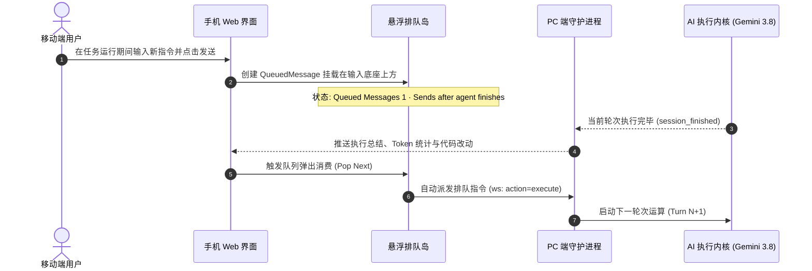

# Google Antigravity 2.0 终极产品需求与交互规范大白皮书 (Master PRD & UI Spec)

> **版本**：v2.0.0-MASTER  
> **基准参考**：`https://antigravity.google.com/r/c0ceb386-2b04-427b-82fa-882c28bf3ea4-v2` & 生产环境移动端真机全量实测  
> **基准视口**：390 × 844 px (iPhone / Android 主流移动设备)  
> **文档定位**：将业务架构模型、数据实体关系、跨端通信协议、设计 Token 体系、六大核心模块像素级规范、手势动效时序全面合一的终极指导白皮书。

---

## 目录
- [1. 业务全景与产品定位 (Product Landscape)](#1-业务全景与产品定位-product-landscape)
- [2. 核心业务实体与数据模型 (Core Entities & Schema)](#2-核心业务实体与数据模型-core-entities--schema)
- [3. 状态机流转与执行生命周期 (State Machines & Flow)](#3-状态机流转与执行生命周期-state-machines--flow)
- [4. 产品功能模块树形结构 (PRD Functional Tree)](#4-产品功能模块树形结构-prd-functional-tree)
- [5. 视觉设计系统与 Google Design Tokens (Visual Foundation)](#5-视觉设计系统与-google-design-tokens-visual-foundation)
- [6. 移动端视口、安全区与虚拟键盘适配 (Mobile Viewport Engine)](#6-移动端视口安全区与虚拟键盘适配-mobile-viewport-engine)
- [7. 六大核心交互模块像素级规范 (Pixel-Level Component Specs)](#7-六大核心交互模块像素级规范-pixel-level-component-specs)
  - [7.1 顶栏全局状态与导航 (App Header)](#71-顶栏全局状态与导航-app-header)
  - [7.2 签名式吸附输入底座 (Docked Input Island)](#72-签名式吸附输入底座-docked-input-island)
  - [7.3 悬浮非阻塞排队岛 (Queued Messages Island)](#73-悬浮非阻塞排队岛-queued-messages-island)
  - [7.4 单轮会话统一容器与步骤折叠系统 (Single Turn & Steps Accordion)](#74-单轮会话统一容器与步骤折叠系统-single-turn--steps-accordion)
  - [7.5 任务与终端控制台抽屉 (Terminal Sheet)](#75-任务与终端控制台抽屉-terminal-sheet)
  - [7.6 移动端代码审查全屏抽屉 (Mobile Diff Reviewer)](#76-移动端代码审查全屏抽屉-mobile-diff-reviewer)
- [8. 动效缓动函数与手势时序表 (Motion & Timing)](#8-动效缓动函数与手势时序表-motion--timing)
- [9. 跨端通信协议与 WebSocket 事件规范 (WebSocket Protocol)](#9-跨端通信协议与-websocket-事件规范-websocket-protocol)
- [10. DOM 树结构与 CSS 类名工程规范 (BEM Specs)](#10-dom-树结构与-css-类名工程规范-bem-specs)

---

## 1. 业务全景与产品定位 (Product Landscape)

Antigravity 2.0 是 Google 打造的 **AI-First 跨端自主编码协同系统 (Agentic Remote OS)**。它不仅是一个对话界面，而是一套将**移动出行场景**与**重度开发主机**深度联动的分布式控制台。

```
Google Antigravity 2.0 业务拓扑架构
│
├── [移动伴侣 (Mobile Web / PWA)] —— 掌上控制枢纽
│   ├── 随时随地：上下班地铁、会议室、工位离开期间随身监控
│   ├── 轻量决策：方案审批 (Plan)、代码差异审查 (Diff)、高危权限放行 (Approval)
│   └── 异步离线：灵感或报错截图随手提交，自动进入排队岛，无感调度
│
├── [安全隧道通道 (Cloudflare Tunnel / WebSocket)] —— 跨网穿透
│   ├── 双向全双工流式传输 (Full-Duplex Streaming)
│   └── 端到端消息确认与重连保活 (ACK & Heartbeat)
│
└── [宿主守护进程 (CloudWork Daemon on PC)] —— 本地算力中心
    ├── 本地工作区文件系统操作 (Workspace FS)
    ├── 本地 PTY 终端会话与多任务并发调度 (Running Tasks)
    └── 驱动多 Agent 执行内核 (Gemini 3.8 / Claude Code / Codex)
```

---

## 2. 核心业务实体与数据模型 (Core Entities & Schema)

Antigravity 2.0 的全业务体系严格解耦为 7 大实体对象：

```
业务实体模型 (Entity Relationship)
├── 1. Session (会话运行体)
│   ├── session_id: String (UUID, 如 c0ceb386-2b04-427b-82fa-882c28bf3ea4-v2)
│   ├── workspace_root: String (绑定的工作区绝对路径，支持跨目录切换)
│   ├── active_agent: Enum [Gemini 3.8 Flash High, Claude Code, OpenAI Codex, Aider]
│   ├── status: Enum [idle, running, waiting_approval, completed, terminated]
│   └── turns: List<Turn>
│
├── 2. Turn (单轮问答容器 - Single Turn Container)
│   ├── turn_id: String
│   ├── timestamp: DateTime
│   ├── user_input: UserInput (提问正文、@ 引用资源、图片附件列表)
│   ├── thinking: ThinkingBlock (深度思考展开/折叠、耗时)
│   ├── steps: List<ToolStep> (已聚合折叠的终端命令与工具执行记录)
│   ├── message: MarkdownContent (纯净的人类可读正文，琥珀金语法高亮)
│   ├── artifacts: List<Artifact> (架构方案、测试报告、Walkthrough)
│   ├── file_diff: DiffSummary (代码改动统计与文件清单)
│   └── metrics: TurnMetrics (Token 统计、执行耗时、退出码)
│
├── 3. QueuedMessage (非阻塞排队消息)
│   ├── queue_id: String
│   ├── prompt: String
│   ├── attachments: List<ImageAttachment> (图片缩略图集合)
│   ├── status: Enum [queued, dispatching, cancelled]
│   └── priority: Integer (支持插队抢占)
│
├── 4. RunningTask (后台常驻与异步任务)
│   ├── task_id: String
│   ├── command_line: String (如 "powershell go test ./...")
│   ├── start_time: DateTime
│   ├── elapsed_seconds: Integer
│   ├── terminal_output: Stream<String> (实时 ANSI 流式日志)
│   └── interruptible: Boolean (支持 ⏹ 一键强制终止)
│
├── 5. Artifact (交付工件)
│   ├── artifact_type: Enum [ImplementationPlan, Walkthrough, ArchitectureReport]
│   ├── title: String (如 "Implementation Plan")
│   ├── summary: String (双行截断预览)
│   ├── content_markdown: String
│   └── review_status: Enum [pending_review, approved, rejected]
│
├── 6. FileDiff (变更审查集)
│   ├── files_changed_count: Integer (如 5 files changed)
│   ├── insertions_count: Integer (如 +1912)
│   ├── deletions_count: Integer (如 -1183)
│   └── patches: List<FilePatch> (单列内联 Unified Diff 补丁树)
│
└── 7. ApprovalRequest (高危操作权限单)
    ├── request_id: String
    ├── command_or_tool: String
    ├── risk_level: Enum [low, medium, high]
    └── status: Enum [pending, allowed, rejected]
```

---

## 3. 状态机流转与执行生命周期 (State Machines & Flow)

### 3.1 单轮执行与排队消费时序 (Sequence Diagram)



---

## 4. 产品功能模块树形结构 (PRD Functional Tree)

```
Google Antigravity 2.0 移动端功能架构树
│
├── 1. 顶栏状态与导航 (App Header)
│   ├── 1.1 会话抽屉与项目树触发 (arrow_back / 抽屉拉起)
│   ├── 1.2 空间与设备微脉冲指示 (Workspace & Device Pulse)
│   └── 1.3 辅助动作功能组
│       ├── 终端控制台快捷键 (Terminal Drawer Trigger)
│       ├── 全屏代码改动审查 (Diff Review Trigger)
│       ├── 会话历史索引 (Session History)
│       └── 彩环个人中心头像 (Profile Avatar Ring)
│
├── 2. 主对话交互画布 (Conversation Canvas)
│   ├── 2.1 用户提问气泡 (深色胶囊 + 横向滚动多图缩略图)
│   └── 2.2 Agent 单轮统一回复容器 (Single Turn Container)
│       ├── 💭 深度思考折叠条 (Thinking Accordion · 耗时展示)
│       ├── ⚙️ 步骤聚合折叠清单 (Steps Accordion · 终结 15 个胶囊霸屏)
│       ├── ⚠️ 行内高危权限审批单 (拒绝 / 允许执行)
│       ├── 📝 Markdown 正文排版与官方琥珀金代码高亮 (#f2c94c)
│       ├── 📄 交付工件卡片 (Implementation Plan 双行截断预览)
│       ├── 📁 代码变更卡片 (X files changed +A -B > Review)
│       └── 📋 交互反馈底栏 (Material 矢量图标：复制、点赞、点踩)
│
├── 3. 悬浮非阻塞排队岛 (Queued Messages Island)
│   ├── 3.1 运行期非阻塞输入监听
│   ├── 3.2 随附图片缩略图微型画廊
│   ├── 3.3 立即插队直发 (arrow_forward)
│   ├── 3.4 弹回重新编辑 (edit)
│   └── 3.5 队列条目删除 (delete)
│
├── 4. 签名式吸附输入底座 (Docked Input Island)
│   ├── 4.1 顶置任务运行指示条 (● 2 tasks running 00:15 ^)
│   ├── 4.2 自适应弹性文本框 (支持 40px ~ 140px 动态拉伸)
│   └── 4.3 底部工具栏
│       ├── [+] 扩展动作面板 (拍照/上传/引用/快捷指令)
│       ├── [Gemini 3.8 Flash High ˅] 模型药丸选择器
│       └── 自适应圆形三态发射键 (Disabled / Send / Stop ⏹)
│
└── 5. 辅助抽屉与弹窗矩阵 (Drawers & Sheets Matrix)
    ├── 5.1 工作区与历史会话左侧抽屉 (切换 PC 绝对路径 / 新建对话)
    ├── 5.2 终端控制台抽屉 (Terminal Sheet · ANSI 颜色与任务终止)
    ├── 5.3 移动端全屏代码审查抽屉 (Mobile Diff Reviewer · 单列内联审查)
    └── 5.4 工件全屏阅读模态 (Artifact Fullscreen Reader)
```

---

## 5. 视觉设计系统与 Google Design Tokens (Visual Foundation)

### 5.1 颜色系统 (Color Tokens)

| Token 变量名 | 默认色值 | 用途与规范说明 |
| :--- | :--- | :--- |
| `--ga-bg-canvas` | `#131314` | 主画布底色，纯正深空灰黑，消除眼部视觉疲劳 |
| `--ga-bg-surface-1` | `#1e1f20` | 一级表面（输入底座、卡片底色、抽屉面板） |
| `--ga-bg-surface-2` | `#282a2c` | 二级表面（悬浮排队岛、用户提问气泡、代码块背景） |
| `--ga-bg-surface-hover` | `#333538` | 交互高亮与悬停触控状态 |
| `--ga-border-subtle` | `rgba(255, 255, 255, 0.08)` | 1px 微米级高质感边框，形成轻微轮廓区隔 |
| `--ga-border-focus` | `rgba(168, 199, 250, 0.40)` | 输入聚焦与高亮边框 |
| `--ga-text-primary` | `#e3e3e3` | 主阅读文本，高对比度但避免纯白的刺眼感 |
| `--ga-text-secondary` | `#8e918f` | 次要信息（时间戳、Token 数、副标题） |
| `--ga-text-tertiary` | `#5e615f` | 弱化信息（快捷键提示、占位文字、折叠图标） |
| `--ga-accent-blue` | `#a8c7fa` | 谷歌专属软蓝（链接、高亮按钮底色、活动徽章） |
| `--ga-accent-gold` | `#f2c94c` | 标志性琥珀金（关键路径、参数标签、行内代码高亮） |
| `--ga-accent-gold-bg`| `rgba(242, 201, 76, 0.12)` | 琥珀金轻质衬底（行内代码块背景） |
| `--ga-status-green` | `#46a049` | 成功、在线脉冲指示灯、Git Diff 增量行 |
| `--ga-status-red` | `#eb5757` | 失败、强制停止键、Git Diff 删除行 |

### 5.2 圆角与排版系统 (Radius & Typography)

```css
:root {
  /* 圆角规范 */
  --ga-radius-xs: 4px;     /* 标签芯片、行内代码块 */
  --ga-radius-sm: 8px;     /* 步骤折叠容器、缩略图 */
  --ga-radius-md: 12px;    /* 卡片容器、模型切换药丸 */
  --ga-radius-lg: 16px;    /* 悬浮排队岛、工件卡片 */
  --ga-radius-xl: 24px;    /* 输入底座外壳、底部抽屉顶边缘 */
  --ga-radius-full: 9999px;/* 圆形控制键、头像环 */

  /* 字体排版 */
  --ga-font-brand: "Google Sans", -apple-system, BlinkMacSystemFont, sans-serif;
  --ga-font-text: "Google Sans Text", Roboto, "Helvetica Neue", sans-serif;
  --ga-font-mono: "JetBrains Mono", "Fira Code", SFMono-Regular, Consolas, monospace;
}
```

---

## 6. 移动端视口、安全区与虚拟键盘适配 (Mobile Viewport Engine)

```
390px 真实视口垂直布局
┌───────────────────────────────────────┐ 0px
│ [Header] 56px 高度，固定贴顶，背景微毛玻璃 │
├───────────────────────────────────────┤ 56px
│                                       │
│ [Scrollable Message Canvas]           │
│ 可滚轮主画布，自动下沉避让底部组件        │
│ padding-bottom: calc(140px + safe)    │
│                                       │
├───────────────────────────────────────┤
│ [Queued Messages Island] (条件悬浮 44px)│ 距底座 8px
├───────────────────────────────────────┤
│ [Docked Input Island] (高度 84~168px)  │ 浮动沉底
│ margin: 0 12px 12px 12px              │
└───────────────────────────────────────┘ 844px
  [Home Indicator / Safe Area] 34px
```

```javascript
// VisualViewport 键盘高度实时同步 JS 引擎
if (window.visualViewport) {
  window.visualViewport.addEventListener('resize', () => {
    const keyboardHeight = Math.max(0, window.innerHeight - window.visualViewport.height);
    document.documentElement.style.setProperty('--ga-keyboard-height', `${keyboardHeight}px`);
    scrollToBottom(true);
  });
}
```

---

## 7. 六大核心交互模块像素级规范

### 7.1 顶栏全局状态与导航 (App Header)
- **容器规格**：高度 `56px`，贴顶固定，`padding: 0 12px`，背景 `rgba(19, 19, 20, 0.85)`，伴随 `backdrop-filter: blur(12px)`。
- **指示灯规格**：`6 × 6 px` 圆点，在线为 `#46a049` 并附带 1.8s 循环呼吸光晕 (`box-shadow: 0 0 0 4px rgba(70, 160, 73, 0.2)`)。
- **动作按钮**：统一 `36 × 36 px` 圆形轻质交互面，图标尺寸 `20px`（包含终端、比对、抽屉与彩环头像）。

### 7.2 签名式吸附输入底座 (Docked Input Island)
- **浮动坐标**：距离屏幕底部 `calc(var(--ga-bottom-offset) + var(--ga-keyboard-height))`，两侧边距各 `12px`。
- **外壳容器**：圆角 `24px`，背景 `#1e1f20`，微米边框 `1px solid rgba(255, 255, 255, 0.08)`，毛玻璃 `blur(16px)`。
- **内嵌任务条**：高度 `30px`，下划线分割，绿点闪烁 + `2 tasks running (00:15)` + 折叠向上箭头 `^`。
- **自适应文本框**：字号 `14px`，行高 `20px`，最小单行高度 `24px`，最大弹性高度 `120px`。
- **底部工具组**：
  - `+` 键：`32 × 32 px` 圆形。
  - 模型药丸：`28px` 高度，半圆胶囊，字号 `12px`，带 `expand_more` 箭头。
  - 圆形发射键：`34 × 34 px`，无输入时灰化不可点，有输入时亮白变黑字，任务执行中且框为空时变为黑色停止方块 `stop`。

### 7.3 悬浮非阻塞排队岛 (Queued Messages Island)
- **挂载规则**：吸附于输入底座正上方 `8px` 处，Agent 运行期间有新输入时触发。
- **容器规格**：高度 `44px`，全宽，圆角 `14px`，背景 `#282a2c`，外发光投影 `0 4px 20px rgba(0, 0, 0, 0.35)`。
- **多图缩略图**：`24 × 24 px` 圆角缩略图，多图显示 `+N` 灰色徽章。
- **三合一控制**：立即插队直发 (`arrow_forward`)、弹回编辑 (`edit`)、删除 (`delete`)。

### 7.4 单轮会话统一容器与步骤折叠系统 (Single Turn & Steps Accordion)
- **杜绝刷屏核心（Steps Accordion）**：
  - 默认折叠态占据一行 `32px`：`⚙️ 已完成 10 个执行步骤 [明细 >]`。
  - 展开态平滑滑出时光轴，每行展示命令微标与等宽命令名，点击就地展开 stdout。
- **深度思考折叠条**：`32px` 高度，斜体淡灰字 `💭 Thinking Process (耗时 3.2s)`。
- **工件卡片 (Implementation Plan)**：深色圆角卡片，左置文档蓝标，中段双行截断预览，点击全屏展开。
- **变更卡片 (Diff Review Card)**：`48px` 通栏卡片，绿字 `+1912`，红字 `-1183`，右侧触控按钮 `[ Review > ]`。

### 7.5 任务与终端控制台抽屉 (Terminal Sheet)
- **滑动手势**：点击顶栏终端图标或任务运行头唤起，默认覆盖屏幕 `70%`，可上推至 `95%` 全屏。
- **顶部手柄**：`36 × 4 px` 居中圆角条。
- **终端面板**：纯黑背景 `#0c0d0e`，等宽字体 `JetBrains Mono 12px`，支持 ANSI 终端流式着色，右上角常驻 `[ ⏹ 终止任务 ]` 红色按钮。

### 7.6 移动端代码审查全屏抽屉 (Mobile Diff Reviewer)
- **审查版式**：单列内联 Unified Diff，消除手机端分栏阅读障碍。
- **文件树折叠**：每个文件一个独立折叠栏，右侧显示增减行数。
- **行级高亮**：新增行淡绿衬底 (`rgba(70, 160, 73, 0.15)`)，删除行淡红衬底 (`rgba(235, 87, 87, 0.15)`)，等宽字体，支持水平横向流畅滑动。

---

## 8. 动效缓动函数与手势时序表 (Motion & Timing)

```css
:root {
  --ga-ease-decelerate: cubic-bezier(0.05, 0.7, 0.1, 1.0); /* 抽屉滑出 */
  --ga-ease-accelerate: cubic-bezier(0.3, 0.0, 0.8, 0.15); /* 抽屉关闭 */
  --ga-ease-standard:   cubic-bezier(0.2, 0.0, 0.0, 1.0);   /* 尺寸缩放 */
  --ga-ease-spring:     cubic-bezier(0.34, 1.56, 0.64, 1);  /* 按钮与排队岛弹性反馈 */
}
```

| 交互场景 | 目标选择器 | 持续时长 | 缓动曲线 | 关键属性变化 |
| :--- | :--- | :--- | :--- | :--- |
| **底部控制台抽屉滑出** | `.ga-sheet--terminal` | `320ms` | `--ga-ease-decelerate` | `transform: translateY(100% -> 0)` |
| **排队岛弹出挂载** | `.ga-queued-island` | `220ms` | `--ga-ease-spring` | `transform: scale(0.95 -> 1.0), opacity` |
| **步骤折叠单行展开** | `.steps-accordion` | `240ms` | `--ga-ease-standard` | `max-height: 32px -> 400px` |
| **发送按钮三态切换** | `.ga-send-btn` | `160ms` | `--ga-ease-spring` | `transform: scale(1.0 -> 1.1 -> 1.0)` |
| **遮罩层淡入淡出** | `.ga-scrim-overlay` | `200ms` | `--ga-ease-standard` | `opacity: 0 -> 1` |

---

## 9. 跨端通信协议与 WebSocket 事件规范 (WebSocket Protocol)

客户端（手机浏览器）与 PC 端守护进程通过单连接 WebSocket 进行全双工通信：

### 9.1 上行指令 (Client -> Server)
```json
// 1. 发起或追加排队指令
{
  "action": "execute",
  "prompt": "帮我优化一下数据库连接池",
  "attachments": ["base64://image-data..."],
  "workspace": "e:\\privateproject\\cloudwork",
  "agent": "gemini-3.8-flash"
}

// 2. 动态切换工作区绝对路径
{
  "action": "set_workspace",
  "workspace": "d:\\another-project"
}

// 3. 强制终止后台任务
{
  "action": "interrupt",
  "task_id": "task-1117"
}
```

### 9.2 下行流式事件 (Server -> Client)
```json
// 1. 深度思考增量流
{ "type": "thinking_chunk", "turn_id": "t-1", "delta": "正在分析内存分配..." }

// 2. 工具与命令行步骤执行 (Steps Accordion 数据源)
{
  "type": "tool_step",
  "turn_id": "t-1",
  "step_index": 3,
  "tool_name": "run_command",
  "command": "powershell Get-Process",
  "status": "completed",
  "stdout": "..."
}

// 3. 纯净正文 Markdown 增量
{ "type": "message_chunk", "turn_id": "t-1", "delta": "优化方案如下：" }

// 4. 单轮完成，附带 Token 消耗与代码改动
{
  "type": "turn_completed",
  "turn_id": "t-1",
  "metrics": { "duration_ms": 3200, "tokens": 1420 },
  "diff_summary": { "files_changed": 3, "insertions": 84, "deletions": 22 }
}
```

---

## 10. DOM 树结构与 CSS 类名工程规范 (BEM Specs)

全系统采用 `ga-` 前缀规范，与 CloudWork 前端无缝对接：

```
Block:        .ga-[block]
Element:      .ga-[block]__[element]
Modifier:     .ga-[block]--[modifier] 或 .is-[state]
```

### 核心结构映射
- `.ga-header`：全局顶栏
- `.ga-canvas`：消息对话主画布
- `.ga-turn`：单轮问答容器
  - `.ga-turn__user`：用户发言气泡
  - `.ga-turn__agent`：Agent 统一回复卡片
  - `.ga-turn__thinking`：深度思考折叠条
  - `.ga-turn__steps`：步骤折叠聚合器 (`.steps-accordion`)
  - `.ga-turn__markdown`：正文排版区
  - `.ga-turn__diff-card`：变更审查卡片
  - `.ga-turn__plan-card`：工件计划卡片
  - `.ga-turn__footer`：反馈与数据统计底栏
- `.ga-queued-island`：悬浮排队岛
- `.ga-docked-island`：吸附输入底座
  - `.ga-docked-island__task-bar`：顶置运行条
  - `.ga-docked-island__input`：弹性输入区
  - `.ga-docked-island__actions`：底置工具栏
- `.ga-sheet`：抽屉基类
  - `.ga-sheet--terminal`：终端抽屉
  - `.ga-sheet--diff`：代码审查抽屉
  - `.ga-sheet--drawer`：左侧历史会话抽屉
